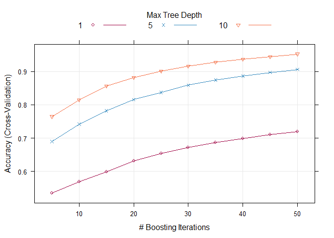

# Machine Learning project
Joris Van den Bossche  
15 september 2016  


# Synopsis
A training and testing data set from [groupware](http://groupware.les.inf.puc-rio.br/har) is examined. The goal is to predict the classe of the cases in the test set by training a model. A random forest model and a boosted forest model are set up and their accuracies are tested with k-fold cross validation. Eventually the random forest model is chosen as the best performing model. With accuracy of 98.3%, the classes of the testing data are predicted.

# Data
The data used for this project is collected from cloudfront. More information about this data set can be found [here](http://groupware.les.inf.puc-rio.br/har), and more specifically on this data set [here](http://groupware.les.inf.puc-rio.br/public/papers/2013.Velloso.QAR-WLE.pdf).

```r
training <- read.csv("https://d396qusza40orc.cloudfront.net/predmachlearn/pml-training.csv", stringsAsFactors = FALSE)
testing <- read.csv("https://d396qusza40orc.cloudfront.net/predmachlearn/pml-testing.csv", stringsAsFactors = FALSE)
```

# Data exploration
The data frame is very large, so it would be pointless to look at every variable seperately and make plots.

```r
dim(training)
```

```
## [1] 19622   160
```

The column that will be producted is the "class" column.

```r
table(training$classe)
```

```
## 
##    A    B    C    D    E 
## 5580 3797 3422 3216 3607
```

It seems the different outcomes are somewhat evenly distributed among the data.

# Data Cleaning and preprocessing
A lot of columns are classified in the training data set as character while they are actually numerical or dates. All the character columns are set in the right format:

```r
for(i in c("user_name", "new_window", "classe")) training[, i] <- factor(training[, i])
training$cvtd_timestamp <- as.Date(training$cvtd_timestamp, format = "%d/%m/%Y %H:%M")
training$new_window <- ifelse(training$new_window == "yes", 1, 0)
chars <- sapply(1:160, function (x){class(training[, x]) == "character"})
for(i in which(chars)) training[, i] <- as.numeric(training[, i])
```

Before a model can be set up, good predictors must be found. A first filterring of the 159 possible predictors can be done by identifying the zero variance columns, using the function "nearZeroVar" of the caret library, and removing them from the data frame.

```r
library(caret)
nzv <- nearZeroVar(x = training)
training <- training[,-nzv]
```

```
##  [1]   6  14  17  26  51  52  53  54  55  56  57  58  59  75  78  79  81
## [18]  82  89  92 101 127 130 131 134 137 139 142 143 144 145 146 147 148
## [35] 149 150
```

Another observation is a lot of columns have many NA values. Columns with more than 90% NA are removed from the training data frame.

```r
mostlyNA <- which(data.frame(colSums(is.na(training)) > 
                               dim(training)[1]*0.9
                             )[,1])
training <- training[,-mostlyNA]
```

```
##  [1]  11  12  13  14  15  16  17  18  19  20  21  22  23  24  25  26  27
## [18]  28  29  30  31  32  46  56  57  58  59  60  61  62  63  64  65  69
## [35]  70  71  72  73  74  75  76  77  78  79  80  82  83  84  85  86  87
## [52]  88  89  90  91 104 105 106 107 108 109 110 111 112 114
```

Surprisingly, there are no more missing values in our data frame anymore after this step! It seems the columns either contained more than 90% NA values, or no NA values at all. In the next step the correlations are looked into for the numeric columns. The function "findCorrelation" will find the columns that are highly correlated with other columns so they would be best to be removed.

```r
correl <- findCorrelation(cor(training[,-c(1,2, 5,59)]), cutoff = 0.9)
training <- training[,-correl]
```

```
## [1] 13  4 12 11 34 36 21
```

After this there are still 52 columns left with possible predictors. Because of the large amount of columns, it would be a good idea to look at principal component analysis to reduce the amount of columns to make the final model less computationally heavy.

```r
set.seed(100)
preProcess <- preProcess(training, method = "pca")
```

```
## Created from 19622 samples and 52 variables
## 
## Pre-processing:
##   - centered (49)
##   - ignored (3)
##   - principal component signal extraction (49)
##   - scaled (49)
## 
## PCA needed 23 components to capture 95 percent of the variance
```

It will be indeed good to use pca as preprocessing, as 95% of the variance can be explained by only 23 columns.  

# Modelling
The part that is meant to be predicted is the "classe" column. Possible outcomes are numbers A through E. This means the problem is a classification problem. Supervised methods like linear regression and naive bayes will therefore be less interesting. The most promising methods would be decision trees, and boosting.  
The first model will be using decision trees on our data set. The default amount of trees used is 400, which takes a lot of computational power, so the number of trees is set to 50. The model's performance can be improved by adding more trees.

```r
randForModel <- train(data = training, classe ~ .,method = "rf", ntree = 50,
                      preProcess=c("pca")) # This calculation takes a few minutes!
randForModel
```

```
## Random Forest 
## 
## 19622 samples
##    51 predictor
##     5 classes: 'A', 'B', 'C', 'D', 'E' 
## 
## Pre-processing: principal component signal extraction (55), centered
##  (55), scaled (55) 
## Resampling: Bootstrapped (25 reps) 
## Summary of sample sizes: 19622, 19622, 19622, 19622, 19622, 19622, ... 
## Resampling results across tuning parameters:
## 
##   mtry  Accuracy   Kappa    
##    2    0.9886737  0.9856701
##   28    0.9712527  0.9636308
##   55    0.9709855  0.9632925
## 
## Accuracy was used to select the optimal model using  the largest value.
## The final value used for the model was mtry = 2.
```

```r
randForModel$finalModel$confusion
```

```
##      A    B    C    D    E class.error
## A 5569   10    0    0    1 0.001971326
## B   23 3751   20    0    3 0.012114827
## C    1   31 3372   17    1 0.014611338
## D    0    1   38 3166   11 0.015547264
## E    0    1    3   19 3584 0.006376490
```

The error rate was determined to be 0.92%, so it is a very good model! To estimate the accuracy on a test set, a crossvalidation of 10 k-folds is used.

```r
train_control <- trainControl(method="cv", number=10, savePredictions = TRUE)
randForModel <- train(data = training, classe ~ .,method = "rf", ntree = 50, 
                      preProcess=c("pca"), trControl = train_control)
library(data.table)
crossVal <- data.table(randForModel$pred)
foldsAccs <- crossVal[, sum(pred == obs)/ .N, by = Resample]
```

```
##     Resample        V1
##  1:   Fold01 0.9879313
##  2:   Fold02 0.9884472
##  3:   Fold03 0.9843777
##  4:   Fold04 0.9850569
##  5:   Fold05 0.9860615
##  6:   Fold06 0.9875977
##  7:   Fold07 0.9903160
##  8:   Fold08 0.9862455
##  9:   Fold09 0.9862455
## 10:   Fold10 0.9865783
```

```r
mean(foldsAccs$V1)
```

```
## [1] 0.9868858
```

```r
sd(foldsAccs$V1)
```

```
## [1] 0.001733129
```

The accuracy is, with 95% certainty, above 98.3%.  

For comparison's sake, a boosting model is also fitted. Using the expand.grid function, multiple options can be explored. Different configurations are tried out using the expand.grid function.

```r
gbmGrid <-  expand.grid(interaction.depth = c(1,5,10), 
                        n.trees = (1:10)*5, 
                        shrinkage = 0.1,
                        n.minobsinnode = 20)
boostModel <- train(data = training, classe ~ .,method = "gbm", 
                    verbose = FALSE, tuneGrid = gbmGrid,
                      preProcess=c("pca"), trControl = train_control)
```

```
## A gradient boosted model with multinomial loss function.
## 50 iterations were performed.
## There were 23 predictors of which 22 had non-zero influence.
```

The different configurations can be easily plotted.

```r
trellis.par.set(caretTheme())
plot(boostModel)
```

<!-- -->

The accuracy goes to a maximum of 95% for a tree depth of 10 with 50 trees. The rising curve means it will probably be even better with more trees and more tree depth. This can be further analysed and tested by altering the gbmGrid variable. Another possibility would be to combine the two models. This would require to check where they (dis)agree and modelling the decisions with for example another decision tree. However, for lack of computational resources and time, this will be skipped and predictions will be made with the random forest function.  

# Making predictions
Using the random forest function, new predictions can be made from the testing data. Before applying the model, the testing data has to go through the same pre-processing. In this case, is is only removing columns. The pca transformation is present in the model.

```r
for(i in c("user_name", "new_window", "problem_id")) testing[, i] <- factor(testing[, i])
testing$cvtd_timestamp <- as.Date(testing$cvtd_timestamp, format = "%d/%m/%Y %H:%M")
testing$new_window <- ifelse(testing$new_window == "yes", 1, 0)
chars <- sapply(1:160, function (x){class(testing[, x]) == "character"})
for(i in which(chars)) testing[, i] <- as.numeric(testing[, i])
testing <- testing[, -nzv]
testing <- testing[, -mostlyNA]
testing <- testing[, -correl]
```

Now predictions can be made, with accuracy of 98.3%.

```r
predictions <- data.frame(Case = testing$X, prediction = predict(randForModel, testing))
```

```
##    Case prediction
## 1     1          B
## 2     2          A
## 3     3          A
## 4     4          A
## 5     5          A
## 6     6          A
## 7     7          A
## 8     8          B
## 9     9          A
## 10   10          A
## 11   11          A
## 12   12          A
## 13   13          B
## 14   14          A
## 15   15          A
## 16   16          A
## 17   17          A
## 18   18          B
## 19   19          B
## 20   20          B
```

# Final words
Thank you for reading this project assignment and have a nice day!
